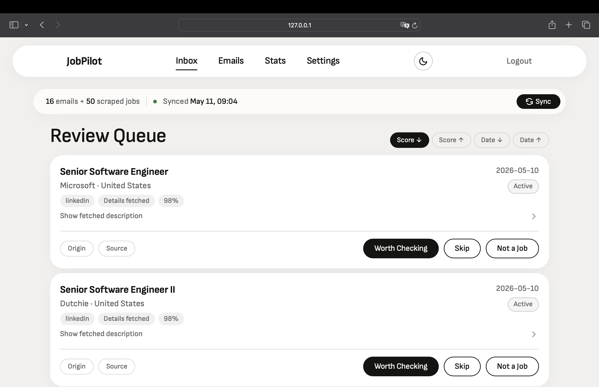
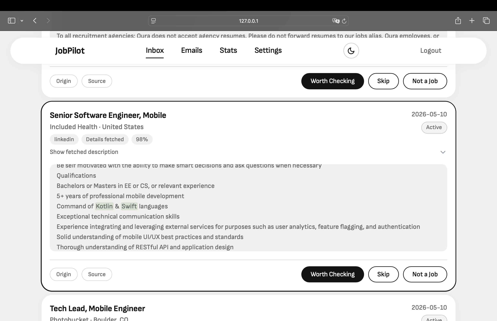
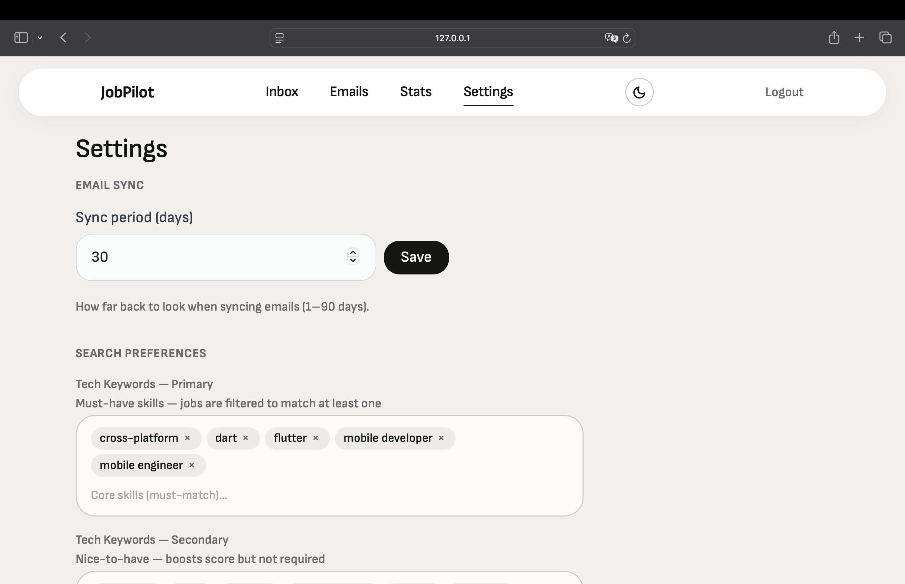

# JobPilot

Local job search autopilot — monitors Gmail for job alerts, parses digests, scores listings, and learns your preferences.

[](https://www.python.org/)
[](https://flask.palletsprojects.com/)
[](https://www.sqlite.org/)
[](https://htmx.org/)
[](LICENSE)

## Screenshots

<!-- Screenshots pending — save images to docs/screenshots/ and they will render below -->








## Features

- **Gmail monitoring with OAuth** — fetches job alert emails automatically
- **Digest parsing** — splits LinkedIn/Indeed/Wellfound digest emails into individual job cards
- **Rule-based scoring** — configurable signals (tech stack, location, seniority, salary, negatives)
- **ML classification** — trains scikit-learn models (LR, RF, GBC, SVM) from user labels
- **Job page scraping** — fetches full descriptions for ambiguous scores, re-scores with full text
- **Signal highlighting** — matched keywords highlighted green (positive) / red (negative) in descriptions
- **Stats dashboard** — Chart.js visualizations of sources, scores, labels, and ML readiness
- **Dark theme** — full light/dark mode with system preference detection
- **ArbeitNow integration** — additional job source via API

## How It Works

```
Gmail API → Fetch alerts → Parse digests → Extract signals
    → Score & classify (rules + ML) → Review inbox
    → Label jobs (worth_checking / skip) → Train ML models
```

JobPilot uses a feedback loop: you review and label jobs as "worth checking" or "skip", and the ML models learn from your decisions. As you label more jobs, predictions improve — the system adapts to your preferences over time.

## Tech Stack

| Layer | Technology |
|-------|------------|
| **Backend** | Python 3.11+, Flask 3, Pydantic Settings |
| **Frontend** | Jinja2, htmx 2.0, Pico CSS v2, Chart.js |
| **Database** | SQLite with WAL mode |
| **ML** | scikit-learn (Logistic Regression, Random Forest, Gradient Boosting, SVM) |
| **Auth** | Google OAuth 2.0 (Gmail API) |
| **Package manager** | Poetry |

## Architecture

| Module | Purpose |
|--------|---------|
| `web/` | Flask routes + Jinja2 templates |
| `services/` | Business logic layer |
| `repositories/` | SQLite data access |
| `classifier/` | Signal extraction, feature scoring, rule engine, ML models |
| `gmail/` | Gmail API client, email parser, digest splitter |
| `scraper/` | Job page scraper, ArbeitNow API client |

## Getting Started

```bash
# Prerequisites: Python 3.11+, Poetry

# 1. Clone and install
git clone https://github.com/idle-dt/jobpilot.git
cd jobpilot
poetry install

# 2. Google credentials
# Create a Google Cloud project, enable Gmail API,
# download OAuth credentials as credentials.json to project root

# 3. Run
PYTHONPATH=src python -m jobpilot serve
# Open http://localhost:5050
```

## License

[MIT](LICENSE)
